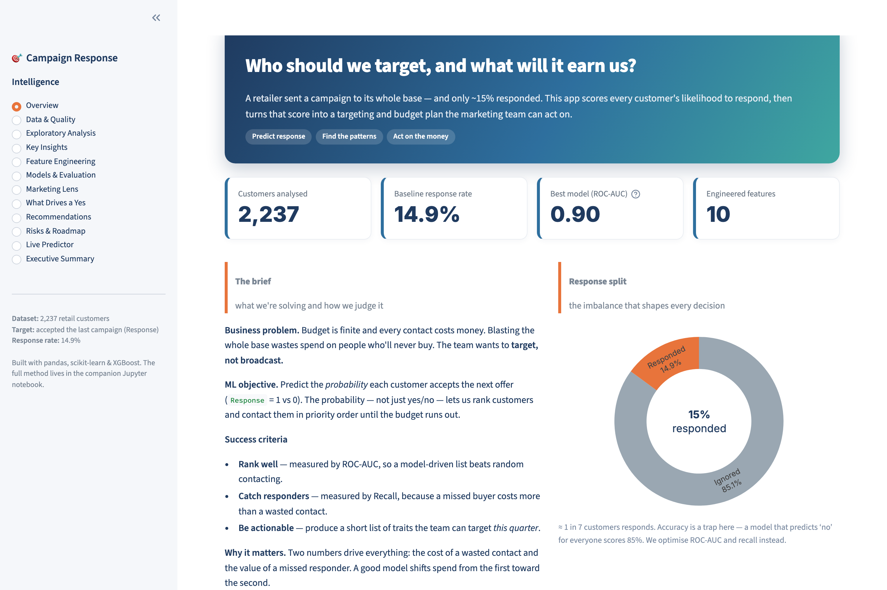
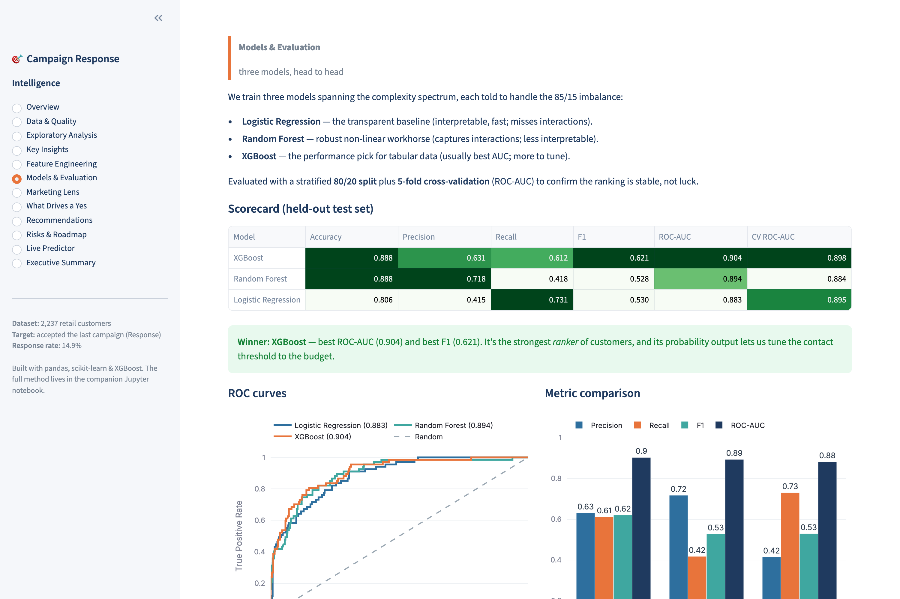
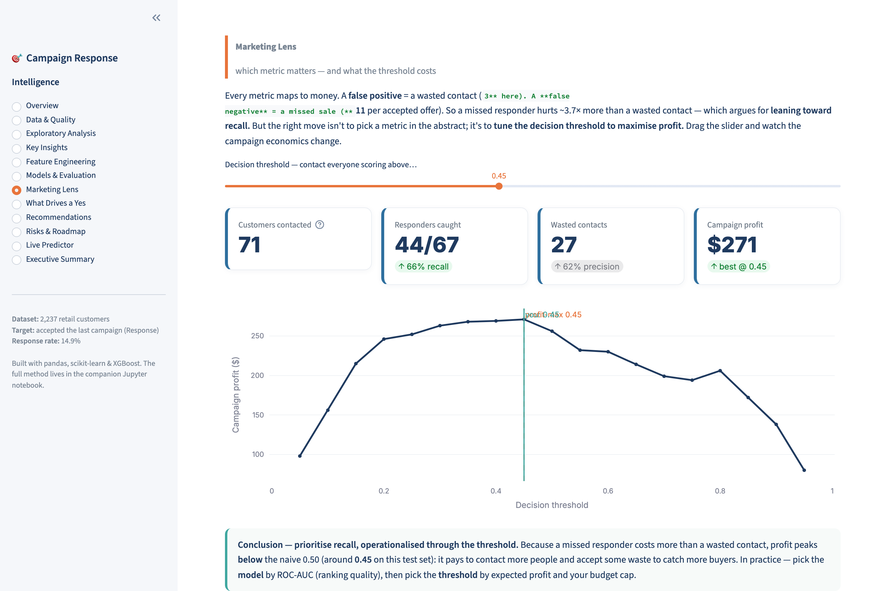
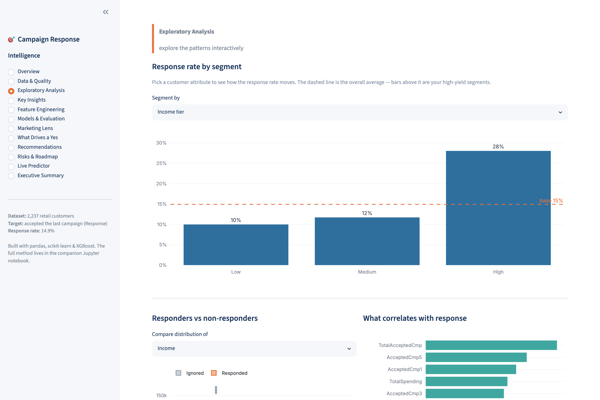
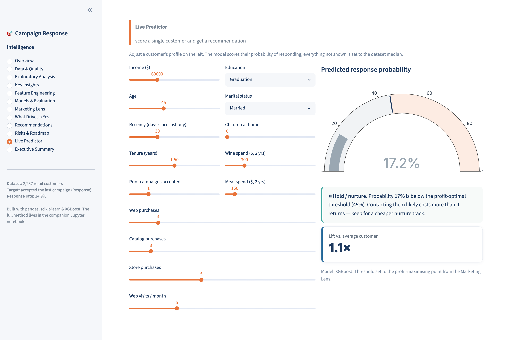

# 🎯 Marketing Campaign Response — Prediction & Business Intelligence

Predict whether a customer will respond to a marketing campaign, and turn that prediction into a
concrete targeting and budget plan. This repo ships **two deliverables that tell the same story**:

| | Deliverable | What it is |
|---|---|---|
| 📓 | **[`notebook/marketing_campaign_analysis.ipynb`](notebook/marketing_campaign_analysis.ipynb)** | A 13-section, end-to-end analysis notebook — data → EDA → features → models → business recommendations |
| 🖥️ | **[`app.py`](app.py)** | An interactive Streamlit app: the same analysis, explorable, plus a **live customer-scoring tool** |

> **Bottom line:** an **XGBoost** model scores every customer's response probability at **ROC-AUC ≈ 0.90**.
> Prior responders convert ~**3× the base rate**, high-income customers ~**2×** — so the same budget,
> aimed at the right people, earns materially more.

---

## 🚀 Live demo

**▶️ Streamlit app:** _add your Streamlit Cloud URL here after deploying (see [Deployment](#-deploy-to-streamlit-cloud))._

<p align="center">
  <br>
  <em>The app walks from the business problem through the data, the model, and the money.</em>
</p>

<table>
<tr>
<td></td>
<td></td>
</tr>
<tr>
<td align="center"><em>Three models, head-to-head</em></td>
<td align="center"><em>Tune the contact threshold to maximise profit</em></td>
</tr>
<tr>
<td></td>
<td></td>
</tr>
<tr>
<td align="center"><em>Interactive EDA</em></td>
<td align="center"><em>Live single-customer scoring</em></td>
</tr>
</table>

---

## 📊 Results at a glance

| Model | Accuracy | Precision | Recall | F1 | ROC-AUC | CV ROC-AUC |
|---|---|---|---|---|---|---|
| **XGBoost** ✅ | 0.89 | 0.63 | 0.61 | **0.62** | **0.90** | 0.90 |
| Random Forest | 0.89 | 0.72 | 0.42 | 0.53 | 0.89 | 0.88 |
| Logistic Regression | 0.81 | 0.42 | 0.73 | 0.53 | 0.88 | 0.90 |

**Top response drivers:** prior campaigns accepted ≫ recency ≈ tenure > income/spending > children at home.

**Five business insights** (full detail in the notebook / app):
1. **Past responders are gold** — accept-once customers respond at 41% vs 8% (≈3×).
2. **Money talks** — high-income respond ~2× more; high-income + prior accept → 47%.
3. **Recency wins** — responders bought ~35 days ago vs ~52 for non-responders.
4. **Childless households respond more** — 27% vs 10%.
5. **Channel reveals intent** — catalog buyers over-respond; raw web *visits* don't predict response.

---

## 🗂️ Repository structure

```
.
├── app.py                       # Streamlit app (deploy this)
├── notebook/
│   └── marketing_campaign_analysis.ipynb   # full 13-section analysis (with outputs)
├── src/                         # clean, reusable production code
│   ├── data.py                  #   load → clean → engineer features
│   ├── models.py                #   leakage-free pipelines, model zoo, evaluation
│   └── viz.py                   #   Plotly chart builders for the app
├── data/
│   └── marketing_campaign.csv   # the dataset (2,240 customers)
├── reports/
│   └── executive_summary.md     # one-page summary for leadership
├── scripts/
│   └── build_notebook.py        # regenerates the notebook from source
├── assets/screenshots/          # images used in this README
├── requirements.txt             # app runtime deps (lean, for Streamlit Cloud)
├── requirements-dev.txt         # + notebook tooling (matplotlib, jupyter, …)
├── runtime.txt                  # Python version hint (3.13)
└── .streamlit/config.toml       # app theme
```

---

## ▶️ Run it locally

```bash
# 1. Create a virtual environment (Python 3.11–3.13)
python3 -m venv .venv && source .venv/bin/activate    # Windows: .venv\Scripts\activate

# 2a. Run the Streamlit app
pip install -r requirements.txt
streamlit run app.py

# 2b. Or run the notebook
pip install -r requirements-dev.txt
jupyter notebook notebook/marketing_campaign_analysis.ipynb
```

The data loader looks for `data/marketing_campaign.csv` and **auto-downloads** a copy if it's missing,
so the notebook also runs cleanly in a fresh Google Colab runtime.

---

## ☁️ Deploy to Streamlit Cloud

1. Push this repo to GitHub.
2. Go to **[share.streamlit.io](https://share.streamlit.io)** → **New app**.
3. Pick your repo/branch and set the main file to **`app.py`**.
4. Under **Advanced settings**, choose **Python 3.13**.
5. Click **Deploy**. Streamlit installs `requirements.txt` automatically and your app goes live.

> ℹ️ **Why not GitHub Pages?** GitHub Pages only serves static files, but Streamlit needs a running
> Python server — so the app is hosted on Streamlit Community Cloud (free). The repo itself, the
> notebook, and this README live on GitHub.

---

## 🔬 Methodology notes

- **Target:** `Response` (1 = accepted the latest campaign, 0 = ignored). Imbalanced at ~15% positive,
  so every model weights the minority class and we optimise **ROC-AUC / recall**, not accuracy.
- **Cleaning:** drop two constant `Z_` columns; remove a few data-entry errors (impossible birth years,
  one $666k income); tidy junk marital-status labels; parse the enrolment date.
- **Features:** 10 engineered signals (Age, TotalSpending, TotalPurchases, SpendingPerPurchase,
  TotalAcceptedCmp, Tenure, EngagementScore, Children, IncomeSegment, AgeGroup).
- **No leakage:** imputation, scaling, and encoding live inside scikit-learn `Pipeline`s, fit only on
  training data and re-fit on every cross-validation fold. Prior `AcceptedCmp` flags are legitimate
  features (known *before* the new campaign).
- **From metric to money:** the *Marketing Lens* sweeps the decision threshold against the campaign's
  unit economics (cost $3 / contact, revenue $11 / acceptance) to pick the **profit-maximising** operating
  point — the bridge from an ML score to a marketing decision.

## 🛠️ Tech stack
Python · pandas · scikit-learn · XGBoost · Streamlit · Plotly · matplotlib/seaborn

## 📚 Dataset
The public **Marketing Campaign** dataset (2,240 retail customers; the Kaggle *marketing-data*
competition). A copy is included in `data/` for reproducibility.
